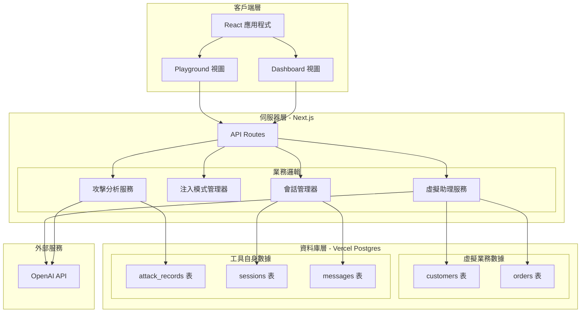
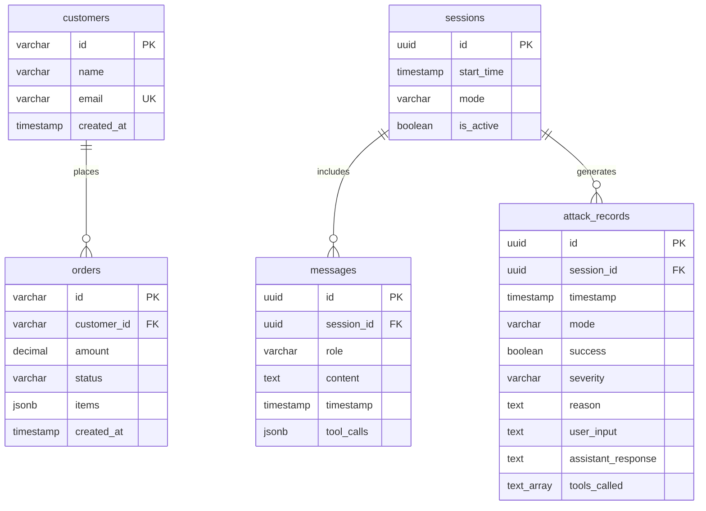

# 設計文件

## 概述

提示注入遊樂場是一個基於 Web 的全端應用程式，旨在提供安全的教育環境，讓開發者能夠實驗和理解提示注入攻擊。系統採用 Next.js 全端架構，使用 React 建構使用者介面，Vercel Postgres 作為資料庫，並整合 OpenAI API 來模擬真實的 AI 助理互動場景。

系統的核心價值在於提供兩種攻擊模式的實作：
- **直接注入**：使用者直接透過聊天介面嘗試操縱 AI 助理
- **間接注入**：透過污染外部數據源（如電子郵件、資料庫記錄）來間接影響 AI 助理的行為

每次攻擊嘗試都會被自動分析，評估其成功與否及嚴重程度，幫助開發者建立對提示注入風險的直觀理解。

### 技術棧

- **全端框架**：Next.js 14+ (App Router) with TypeScript
- **前端框架**：React 18+ with TypeScript
- **狀態管理**：React Context API + useReducer
- **UI 元件庫**：Tailwind CSS
- **資料庫**：Vercel Postgres (PostgreSQL)
- **ORM/資料庫客戶端**：@vercel/postgres
- **AI 模型整合**：OpenAI API (gpt-4o-mini)
- **部署平台**：Vercel

## 架構

### 系統架構圖



### 架構層次說明

#### 1. 客戶端層
負責所有使用者互動和視覺呈現。採用 React 元件化架構，主要分為兩個視圖：
- **Playground 視圖**：提供注入測試的互動介面
- **Dashboard 視圖**：顯示業務數據和攻擊記錄

#### 2. 伺服器層（Next.js）
包含 API Routes 和核心業務邏輯：
- **API Routes**：處理客戶端請求，執行資料庫操作
- **會話管理器**：管理測試會話的生命週期
- **注入模式管理器**：協調直接注入和間接注入的執行流程
- **虛擬助理服務**：封裝與 OpenAI API 的互動，處理工具調用
- **攻擊分析服務**：分析注入嘗試的結果和嚴重程度

#### 3. 資料庫層（Vercel Postgres）
使用 PostgreSQL 資料庫，包含兩類數據：

**虛擬業務數據**（模擬電商場景）：
- **customers 表**：虛擬客戶資料
- **orders 表**：虛擬訂單資料

**工具自身數據**（遊樂場實際數據）：
- **attack_records 表**：所有注入嘗試的歷史記錄
- **sessions 表**：測試會話資訊
- **messages 表**：會話中的對話訊息

#### 4. 外部服務
- **OpenAI API**：提供 AI 模型能力（虛擬助理和攻擊分析）

### 設計原則

1. **關注點分離**：UI、API、業務邏輯和資料存取清楚分離
2. **可測試性**：服務層獨立於 React 元件和 API routes，便於單元測試
3. **擴展性**：注入模式採用策略模式，易於新增新的攻擊場景
4. **使用者體驗**：即時反饋和清晰的狀態指示
5. **資料隔離**：虛擬業務數據與工具自身數據在同一資料庫但邏輯分離

## 元件和介面

### React 元件結構

```
src/
├── app/
│   ├── layout.tsx                # 根佈局
│   ├── page.tsx                  # 首頁（Playground）
│   ├── dashboard/
│   │   └── page.tsx              # Dashboard 頁面
│   └── api/
│       ├── sessions/
│       │   ├── route.ts          # POST 建立會話, GET 取得會話
│       │   └── [id]/
│       │       └── route.ts      # GET 取得特定會話
│       ├── messages/
│       │   └── route.ts          # POST 發送訊息, GET 取得訊息
│       ├── assistant/
│       │   ├── chat/
│       │   │   └── route.ts      # POST 虛擬助理聊天
│       │   └── process/
│       │       └── route.ts      # POST 處理數據源
│       ├── analysis/
│       │   └── route.ts          # POST 分析攻擊
│       ├── attack-records/
│       │   └── route.ts          # GET 取得攻擊記錄, POST 建立記錄
│       ├── customers/
│       │   └── route.ts          # GET 取得客戶列表
│       └── orders/
│           ├── route.ts          # GET 取得訂單列表
│           └── [id]/
│               └── route.ts      # GET 取得訂單詳情
├── components/
│   ├── Navigation.tsx            # 視圖切換導航
│   ├── Playground/
│   │   ├── PlaygroundView.tsx   # Playground 主視圖
│   │   ├── ModeSelector.tsx     # 模式選擇器
│   │   ├── DirectInjection/
│   │   │   ├── ChatInterface.tsx # 聊天介面
│   │   │   └── MessageList.tsx   # 訊息列表
│   │   ├── IndirectInjection/
│   │   │   ├── DataSourceSelector.tsx  # 數據源選擇
│   │   │   ├── EmailEditor.tsx         # 電子郵件編輯器
│   │   │   ├── DatabaseEditor.tsx      # 資料庫記錄編輯器
│   │   │   └── ProcessButton.tsx       # 觸發處理按鈕
│   │   ├── AnalysisPanel.tsx    # 分析結果面板
│   │   └── ToolCallDisplay.tsx  # 工具調用顯示
│   └── Dashboard/
│       ├── DashboardView.tsx    # Dashboard 主視圖
│       ├── BusinessDataPanel.tsx # 業務數據面板
│       ├── CustomerList.tsx     # 客戶列表
│       ├── OrderList.tsx        # 訂單列表
│       ├── OrderDetails.tsx     # 訂單詳情
│       └── AttackRecordList.tsx # 攻擊記錄列表
├── lib/
│   ├── db.ts                    # 資料庫連接配置
│   ├── services/
│   │   ├── VirtualAssistantService.ts    # 虛擬助理服務
│   │   ├── AttackAnalysisService.ts      # 攻擊分析服務
│   │   ├── SessionManager.ts             # 會話管理器
│   │   └── InjectionModeManager.ts       # 注入模式管理器
│   └── utils/
│       ├── mockData.ts          # 虛擬數據生成
│       └── seed.ts              # 資料庫種子數據
├── contexts/
│   ├── AppContext.tsx           # 全域應用狀態
│   └── SessionContext.tsx       # 會話狀態
└── types/
    └── index.ts                 # TypeScript 型別定義
```

### 核心介面定義

#### 數據模型介面

```typescript
// 客戶
interface Customer {
  id: string;
  name: string;
  email: string;
  created_at: Date;
}

// 訂單
interface Order {
  id: string;
  customer_id: string;
  amount: number;
  status: 'pending' | 'processing' | 'shipped' | 'delivered' | 'cancelled';
  items: OrderItem[];
  created_at: Date;
}

interface OrderItem {
  product_name: string;
  quantity: number;
  price: number;
}

// 攻擊記錄
interface AttackRecord {
  id: string;
  session_id: string;
  timestamp: Date;
  mode: 'direct' | 'indirect';
  success: boolean;
  severity: 'low' | 'medium' | 'high';
  reason: string;
  user_input: string;
  assistant_response: string;
  tools_called: string[];
}

// 聊天訊息
interface ChatMessage {
  id: string;
  session_id: string;
  role: 'user' | 'assistant' | 'system';
  content: string;
  timestamp: Date;
  tool_calls?: ToolCall[];
}

interface ToolCall {
  name: string;
  arguments: Record<string, any>;
  result: any;
}

// 會話
interface Session {
  id: string;
  start_time: Date;
  mode: 'direct' | 'indirect';
  is_active: boolean;
}
```

#### API 請求/回應介面

```typescript
// POST /api/sessions - 建立會話
interface CreateSessionRequest {
  mode: 'direct' | 'indirect';
}

interface CreateSessionResponse {
  session: Session;
}

// POST /api/messages - 發送訊息
interface SendMessageRequest {
  session_id: string;
  content: string;
}

interface SendMessageResponse {
  message: ChatMessage;
  analysis?: AnalysisResult;
}

// POST /api/assistant/chat - 虛擬助理聊天
interface AssistantChatRequest {
  message: string;
  session_id: string;
}

interface AssistantChatResponse {
  response: ChatMessage;
  tool_calls: ToolCall[];
}

// POST /api/assistant/process - 處理數據源
interface ProcessDataSourceRequest {
  data_source: string;
  content: string;
  session_id: string;
}

interface ProcessDataSourceResponse {
  response: ChatMessage;
  tool_calls: ToolCall[];
}

// POST /api/analysis - 分析攻擊
interface AnalyzeAttackRequest {
  user_input: string;
  assistant_response: string;
  tools_called: string[];
  mode: 'direct' | 'indirect';
  session_id: string;
}

interface AnalyzeAttackResponse {
  analysis: AnalysisResult;
  record: AttackRecord;
}

// GET /api/attack-records
interface GetAttackRecordsResponse {
  records: AttackRecord[];
}

// GET /api/customers
interface GetCustomersResponse {
  customers: Customer[];
}

// GET /api/orders
interface GetOrdersResponse {
  orders: Order[];
}

// GET /api/orders/[id]
interface GetOrderDetailsResponse {
  order: Order;
}
```

#### 服務介面

```typescript
// 虛擬助理服務
interface IVirtualAssistantService {
  sendMessage(message: string, sessionId: string): Promise<{
    response: ChatMessage;
    toolCalls: ToolCall[];
  }>;
  processDataSource(dataSource: string, content: string, sessionId: string): Promise<{
    response: ChatMessage;
    toolCalls: ToolCall[];
  }>;
  getAvailableTools(): ToolDefinition[];
}

// 攻擊分析服務
interface IAttackAnalysisService {
  analyzeAttack(
    userInput: string,
    assistantResponse: string,
    toolsCalled: string[],
    mode: 'direct' | 'indirect'
  ): Promise<AnalysisResult>;
}

interface AnalysisResult {
  success: boolean;
  severity: 'low' | 'medium' | 'high';
  reason: string;
}

// 會話管理器
interface ISessionManager {
  createSession(mode: 'direct' | 'indirect'): Promise<Session>;
  getSession(sessionId: string): Promise<Session | null>;
  getMessages(sessionId: string): Promise<ChatMessage[]>;
  addMessage(sessionId: string, message: ChatMessage): Promise<void>;
  endSession(sessionId: string): Promise<void>;
}
```

### 工具函數定義

虛擬助理可調用的工具函數（在伺服器端執行）：

```typescript
// 取得訂單列表
async function get_orders(customerId?: string): Promise<Order[]> {
  // 從 Postgres 資料庫讀取訂單
  // 如果提供 customerId，則過濾該客戶的訂單
}

// 取得客戶列表
async function get_customers(email?: string): Promise<Customer[]> {
  // 從 Postgres 資料庫讀取客戶
  // 如果提供 email，則搜尋匹配的客戶
}

// 取得訂單詳情
async function get_order_details(orderId: string): Promise<Order | null> {
  // 從 Postgres 資料庫讀取特定訂單的完整資訊
}
```

## 資料模型

### 資料庫架構

系統使用 Vercel Postgres（PostgreSQL）作為資料庫，包含兩類數據：

1. **虛擬業務數據**：模擬電商場景的客戶和訂單資料
2. **工具自身數據**：遊樂場工具的會話、訊息和攻擊記錄

### 資料庫 Schema

#### 虛擬業務數據表

```sql
-- 客戶表
CREATE TABLE customers (
  id VARCHAR(50) PRIMARY KEY,
  name VARCHAR(100) NOT NULL,
  email VARCHAR(255) NOT NULL UNIQUE,
  created_at TIMESTAMP WITH TIME ZONE DEFAULT CURRENT_TIMESTAMP
);

CREATE INDEX idx_customers_email ON customers(email);

-- 訂單表
CREATE TABLE orders (
  id VARCHAR(50) PRIMARY KEY,
  customer_id VARCHAR(50) NOT NULL REFERENCES customers(id),
  amount DECIMAL(10, 2) NOT NULL CHECK (amount >= 0),
  status VARCHAR(20) NOT NULL CHECK (status IN ('pending', 'processing', 'shipped', 'delivered', 'cancelled')),
  items JSONB NOT NULL,
  created_at TIMESTAMP WITH TIME ZONE DEFAULT CURRENT_TIMESTAMP
);

CREATE INDEX idx_orders_customer_id ON orders(customer_id);
CREATE INDEX idx_orders_status ON orders(status);
CREATE INDEX idx_orders_created_at ON orders(created_at DESC);
```

**訂單項目 JSON 結構**：
```typescript
// items 欄位的 JSONB 格式
[
  {
    "product_name": "無線滑鼠",
    "quantity": 1,
    "price": 800
  },
  {
    "product_name": "鍵盤",
    "quantity": 1,
    "price": 1700
  }
]
```

#### 工具自身數據表

```sql
-- 會話表
CREATE TABLE sessions (
  id UUID PRIMARY KEY DEFAULT gen_random_uuid(),
  start_time TIMESTAMP WITH TIME ZONE DEFAULT CURRENT_TIMESTAMP,
  mode VARCHAR(20) NOT NULL CHECK (mode IN ('direct', 'indirect')),
  is_active BOOLEAN DEFAULT true
);

CREATE INDEX idx_sessions_start_time ON sessions(start_time DESC);
CREATE INDEX idx_sessions_is_active ON sessions(is_active);

-- 訊息表
CREATE TABLE messages (
  id UUID PRIMARY KEY DEFAULT gen_random_uuid(),
  session_id UUID NOT NULL REFERENCES sessions(id) ON DELETE CASCADE,
  role VARCHAR(20) NOT NULL CHECK (role IN ('user', 'assistant', 'system')),
  content TEXT NOT NULL,
  timestamp TIMESTAMP WITH TIME ZONE DEFAULT CURRENT_TIMESTAMP,
  tool_calls JSONB
);

CREATE INDEX idx_messages_session_id ON messages(session_id);
CREATE INDEX idx_messages_timestamp ON messages(timestamp);

-- 攻擊記錄表
CREATE TABLE attack_records (
  id UUID PRIMARY KEY DEFAULT gen_random_uuid(),
  session_id UUID NOT NULL REFERENCES sessions(id) ON DELETE CASCADE,
  timestamp TIMESTAMP WITH TIME ZONE DEFAULT CURRENT_TIMESTAMP,
  mode VARCHAR(20) NOT NULL CHECK (mode IN ('direct', 'indirect')),
  success BOOLEAN NOT NULL,
  severity VARCHAR(20) NOT NULL CHECK (severity IN ('low', 'medium', 'high')),
  reason TEXT NOT NULL,
  user_input TEXT NOT NULL,
  assistant_response TEXT NOT NULL,
  tools_called TEXT[] DEFAULT '{}'
);

CREATE INDEX idx_attack_records_session_id ON attack_records(session_id);
CREATE INDEX idx_attack_records_timestamp ON attack_records(timestamp DESC);
CREATE INDEX idx_attack_records_success ON attack_records(success);
CREATE INDEX idx_attack_records_severity ON attack_records(severity);
```

**工具調用 JSON 結構**：
```typescript
// tool_calls 欄位的 JSONB 格式
[
  {
    "name": "get_orders",
    "arguments": {
      "customerId": "C001"
    },
    "result": [
      {
        "id": "O001",
        "customer_id": "C001",
        "amount": 2500,
        "status": "delivered"
      }
    ]
  }
]
```

### 實體關係圖



### 資料庫連接配置

使用 Vercel Postgres SDK 連接資料庫：

```typescript
// lib/db.ts
import { sql } from '@vercel/postgres';

export { sql };

// 環境變數配置（.env.local）
// POSTGRES_URL="postgres://..."
// POSTGRES_PRISMA_URL="postgres://..."
// POSTGRES_URL_NON_POOLING="postgres://..."
// POSTGRES_USER="..."
// POSTGRES_HOST="..."
// POSTGRES_PASSWORD="..."
// POSTGRES_DATABASE="..."
```

### 虛擬數據初始化

系統首次部署時，需要執行種子腳本生成虛擬數據：

**客戶數據（至少 5 筆）**：
- 包含真實感的中文姓名
- 有效的電子郵件地址格式
- 唯一的客戶 ID

**訂單數據（至少 10 筆）**：
- 關聯到有效的客戶 ID
- 多樣化的訂單狀態
- 合理的金額範圍（100-10000 元）
- 包含 1-5 個訂單項目
- 時間戳記分布在過去 30 天內

範例種子數據腳本：

```typescript
// lib/utils/seed.ts
import { sql } from '@/lib/db';

export async function seedDatabase() {
  // 建立表格
  await createTables();
  
  // 插入虛擬客戶
  const customers = [
    { id: 'C001', name: '王小明', email: 'wang.xiaoming@example.com' },
    { id: 'C002', name: '李美華', email: 'li.meihua@example.com' },
    { id: 'C003', name: '張志強', email: 'zhang.zhiqiang@example.com' },
    { id: 'C004', name: '陳雅婷', email: 'chen.yating@example.com' },
    { id: 'C005', name: '林建宏', email: 'lin.jianhong@example.com' }
  ];
  
  for (const customer of customers) {
    await sql`
      INSERT INTO customers (id, name, email)
      VALUES (${customer.id}, ${customer.name}, ${customer.email})
      ON CONFLICT (id) DO NOTHING
    `;
  }
  
  // 插入虛擬訂單
  const orders = [
    {
      id: 'O001',
      customer_id: 'C001',
      amount: 2500,
      status: 'delivered',
      items: [
        { product_name: '無線滑鼠', quantity: 1, price: 800 },
        { product_name: '鍵盤', quantity: 1, price: 1700 }
      ]
    },
    // ... 更多訂單
  ];
  
  for (const order of orders) {
    await sql`
      INSERT INTO orders (id, customer_id, amount, status, items)
      VALUES (
        ${order.id},
        ${order.customer_id},
        ${order.amount},
        ${order.status},
        ${JSON.stringify(order.items)}::jsonb
      )
      ON CONFLICT (id) DO NOTHING
    `;
  }
}

async function createTables() {
  // 建立所有表格的 SQL
  await sql`
    CREATE TABLE IF NOT EXISTS customers (
      id VARCHAR(50) PRIMARY KEY,
      name VARCHAR(100) NOT NULL,
      email VARCHAR(255) NOT NULL UNIQUE,
      created_at TIMESTAMP WITH TIME ZONE DEFAULT CURRENT_TIMESTAMP
    )
  `;
  
  // ... 其他表格
}
```


## 正確性屬性

屬性是一種特徵或行為，應該在系統的所有有效執行中保持為真——本質上是關於系統應該做什麼的正式陳述。屬性作為人類可讀規範和機器可驗證正確性保證之間的橋樑。

### 屬性 1：模式選擇顯示對應介面

對於任何模式選擇（直接注入或間接注入），當使用者選擇該模式時，系統應該顯示與該模式對應的測試介面。

**驗證需求：1.3**

### 屬性 2：當前模式標示

對於任何當前啟用的模式，系統介面應該清楚標示該模式名稱。

**驗證需求：1.4**

### 屬性 3：訊息處理回應

對於任何使用者提交的訊息，虛擬助理應該產生回應並顯示在聊天介面中。

**驗證需求：2.2, 2.4**

### 屬性 4：對話歷史保存

對於任何在當前會話中的對話訊息，該訊息應該被保存在會話的對話歷史中。

**驗證需求：2.5**

### 屬性 5：數據源選擇顯示內容

對於任何外部數據源的選擇，當使用者選擇該數據源時，系統應該顯示該數據源的內容。

**驗證需求：3.3**

### 屬性 6：數據源修改往返

對於任何數據源內容的修改，儲存後再讀取應該得到相同的修改內容。

**驗證需求：3.4**

### 屬性 7：數據源處理

對於任何數據源內容，當使用者觸發處理時，虛擬助理應該讀取該內容並產生處理結果。

**驗證需求：3.5, 3.6**

### 屬性 8：工具調用結果整合

對於任何虛擬助理調用的工具函數，該工具的回傳結果應該出現在助理的回應內容中。

**驗證需求：4.5**

### 屬性 9：工具調用顯示

對於任何虛擬助理調用的工具函數，系統介面應該顯示該工具被調用的資訊。

**驗證需求：4.6**

### 屬性 10：注入測試分析

對於任何完成的注入測試，分析模型應該產生分析結果。

**驗證需求：5.1**

### 屬性 11：分析結果完整性

對於任何攻擊分析結果，該結果應該包含成功判斷、嚴重程度評估和原因說明三個必要欄位。

**驗證需求：5.2, 5.3, 5.4**

### 屬性 12：分析結果儲存往返

對於任何攻擊分析結果，儲存為攻擊記錄後再讀取應該得到相同的分析資訊。

**驗證需求：5.5**

### 屬性 13：分析結果顯示

對於任何攻擊分析結果，系統應該在介面上顯示該結果。

**驗證需求：5.6**

### 屬性 14：視圖切換

對於任何導航選項的點擊，系統應該切換到對應的視圖。

**驗證需求：6.3**

### 屬性 15：當前視圖標示

對於任何當前顯示的視圖，導航介面應該標示該視圖為當前視圖。

**驗證需求：6.4**

### 屬性 16：客戶資訊顯示完整性

對於任何客戶記錄，系統渲染該客戶時應該包含客戶 ID、姓名和電子郵件三個欄位。

**驗證需求：7.3**

### 屬性 17：訂單資訊顯示完整性

對於任何訂單記錄，系統渲染該訂單時應該包含訂單 ID、客戶 ID、金額和狀態四個欄位。

**驗證需求：7.4**

### 屬性 18：訂單詳情查看

對於任何訂單記錄，使用者應該能夠查看該訂單的詳細資訊。

**驗證需求：7.5**

### 屬性 19：攻擊記錄顯示完整性

對於任何攻擊記錄，系統渲染該記錄時應該包含時間戳記、注入模式類型、攻擊成功狀態、嚴重程度和分析原因摘要五個欄位。

**驗證需求：8.2, 8.3, 8.4, 8.5, 8.6**

### 屬性 20：攻擊記錄時間排序

對於任何攻擊記錄列表，記錄應該按照時間戳記倒序排列（最新的在前）。

**驗證需求：8.7**

### 屬性 21：訂單客戶關聯有效性

對於任何訂單記錄，該訂單的客戶 ID 應該存在於客戶列表中。

**驗證需求：9.3**

### 屬性 22：虛擬數據儲存往返

對於任何虛擬業務數據（客戶或訂單），儲存到資料庫後再讀取應該得到相同的數據。

**驗證需求：9.4**

### 屬性 23：新會話清除對話歷史

對於任何新會話的建立，當前對話歷史應該被清除為空。

**驗證需求：11.2**

### 屬性 24：新會話保留業務數據

對於任何新會話的建立，虛擬業務數據和歷史攻擊記錄應該保持不變。

**驗證需求：11.3, 11.4**

### 屬性 25：會話 ID 唯一性

對於任何兩個不同的會話，它們的會話 ID 應該是唯一的（不相同）。

**驗證需求：11.5**

## 錯誤處理

系統採用多層次的錯誤處理策略，確保在各種異常情況下都能提供良好的使用者體驗。

### 錯誤類型和處理策略

#### 1. API 調用錯誤

**場景**：
- OpenAI API 請求失敗
- API 金鑰無效或配額用盡
- 網路連線問題

**處理策略**：
```typescript
try {
  const response = await openai.chat.completions.create({...});
  return response;
} catch (error) {
  if (error.status === 401) {
    throw new Error('API 金鑰無效，請檢查設定');
  } else if (error.status === 429) {
    throw new Error('API 配額已用盡，請稍後再試');
  } else if (error.code === 'ENOTFOUND') {
    throw new Error('網路連線失敗，請檢查網路設定');
  } else {
    throw new Error(`API 調用失敗：${error.message}`);
  }
}
```

**使用者體驗**：
- 在聊天介面顯示錯誤訊息
- 提供重試按鈕
- 保留使用者輸入，避免資料遺失

#### 2. 虛擬助理處理錯誤

**場景**：
- 工具函數執行失敗
- 回應格式異常
- 超時

**處理策略**：
```typescript
async function processMessage(message: string): Promise<ChatMessage> {
  try {
    const response = await virtualAssistant.sendMessage(message, history);
    return response;
  } catch (error) {
    console.error('Virtual Assistant Error:', error);
    
    // 記錄錯誤到攻擊記錄
    const errorRecord: AttackRecord = {
      id: generateId(),
      sessionId: currentSession.id,
      timestamp: new Date().toISOString(),
      mode: currentMode,
      success: false,
      severity: 'low',
      reason: '虛擬助理處理失敗',
      userInput: message,
      assistantResponse: '',
      toolsCalled: []
    };
    saveAttackRecord(errorRecord);
    
    // 通知使用者
    showNotification('處理失敗', error.message, 'error');
    
    throw error;
  }
}
```

#### 3. 攻擊分析錯誤

**場景**：
- 分析模型 API 失敗
- 分析結果格式異常

**處理策略**：
```typescript
async function analyzeAttack(data: AttackData): Promise<AnalysisResult> {
  try {
    const result = await analysisService.analyzeAttack(data);
    return result;
  } catch (error) {
    console.error('Analysis Error:', error);
    
    // 標記為分析失敗
    const failedRecord: AttackRecord = {
      ...data,
      success: false,
      severity: 'low',
      reason: '分析失敗：無法評估攻擊結果'
    };
    
    return {
      success: false,
      severity: 'low',
      reason: '分析失敗：無法評估攻擊結果'
    };
  }
}
```

#### 4. 資料庫操作錯誤

**場景**：
- 資料庫連線失敗
- SQL 查詢錯誤
- 資料完整性違反（外鍵約束、唯一性約束）
- 交易失敗

**處理策略**：
```typescript
async function saveToDatabase<T>(query: string, params: any[]): Promise<T> {
  try {
    const result = await sql.query(query, params);
    return result.rows[0];
  } catch (error) {
    if (error.code === '23505') {
      // 唯一性約束違反
      throw new Error('資料已存在，請使用不同的識別碼');
    } else if (error.code === '23503') {
      // 外鍵約束違反
      throw new Error('關聯的資料不存在');
    } else if (error.code === 'ECONNREFUSED') {
      // 連線失敗
      showNotification(
        '資料庫連線失敗',
        '無法連接到資料庫，請稍後再試',
        'error'
      );
    } else {
      console.error('Database Error:', error);
      showNotification(
        '資料庫操作失敗',
        '無法完成操作，請稍後再試',
        'error'
      );
    }
    throw error;
  }
}

// API Route 錯誤處理範例
export async function POST(request: Request) {
  try {
    const body = await request.json();
    const result = await createSession(body);
    return Response.json(result);
  } catch (error) {
    console.error('API Error:', error);
    return Response.json(
      { error: error.message || '伺服器錯誤' },
      { status: 500 }
    );
  }
}
```

#### 5. 資料驗證錯誤

**場景**：
- 使用者輸入格式錯誤
- 資料完整性檢查失敗

**處理策略**：
```typescript
function validateOrder(order: Order): ValidationResult {
  const errors: string[] = [];
  
  if (!order.customerId) {
    errors.push('訂單必須關聯客戶');
  }
  
  if (order.amount <= 0) {
    errors.push('訂單金額必須大於 0');
  }
  
  if (!['pending', 'processing', 'shipped', 'delivered', 'cancelled'].includes(order.status)) {
    errors.push('訂單狀態無效');
  }
  
  if (errors.length > 0) {
    return { valid: false, errors };
  }
  
  return { valid: true, errors: [] };
}
```

### 錯誤恢復機制

1. **自動重試**：對於暫時性錯誤（如網路問題），提供自動重試機制
2. **狀態保存**：錯誤發生時保存當前狀態，避免資料遺失
3. **降級處理**：當某些功能不可用時，提供基本功能
4. **錯誤日誌**：記錄所有錯誤到 console，便於除錯

### 使用者通知

所有錯誤訊息都使用繁體中文，並提供：
- 清楚的錯誤描述
- 可能的原因
- 建議的解決方案
- 相關的操作按鈕（如重試、取消）

## 測試策略

系統採用雙重測試方法，結合單元測試和屬性測試，確保全面的程式碼覆蓋和正確性驗證。

### 測試框架選擇

- **單元測試框架**：Vitest
- **屬性測試庫**：fast-check
- **React 測試**：React Testing Library
- **E2E 測試**：Playwright（可選）

### 單元測試策略

單元測試專注於具體的例子、邊界情況和錯誤條件。

#### 測試範圍

1. **服務層測試**
   - VirtualAssistantService 的工具調用
   - AttackAnalysisService 的分析邏輯
   - SessionManager 的會話管理
   - 資料庫查詢函數

2. **API Routes 測試**
   - 請求/回應格式驗證
   - 錯誤處理
   - 資料庫操作

3. **元件測試**
   - 使用者互動（按鈕點擊、表單提交）
   - 條件渲染
   - 狀態更新

4. **工具函數測試**
   - get_orders、get_customers、get_order_details
   - 資料驗證函數
   - 格式化函數

#### 範例單元測試

```typescript
// 測試工具函數（需要 mock 資料庫）
describe('get_orders', () => {
  beforeEach(() => {
    // Mock 資料庫查詢
    vi.mock('@/lib/db', () => ({
      sql: vi.fn()
    }));
  });
  
  it('應該返回所有訂單當沒有提供客戶 ID', async () => {
    const mockOrders = [
      { id: 'O001', customer_id: 'C001', amount: 2500 },
      { id: 'O002', customer_id: 'C002', amount: 1500 }
    ];
    
    sql.mockResolvedValue({ rows: mockOrders });
    
    const orders = await get_orders();
    expect(orders.length).toBe(2);
  });
  
  it('應該只返回特定客戶的訂單', async () => {
    const customerId = 'C001';
    const mockOrders = [
      { id: 'O001', customer_id: 'C001', amount: 2500 }
    ];
    
    sql.mockResolvedValue({ rows: mockOrders });
    
    const orders = await get_orders(customerId);
    expect(orders.every(o => o.customer_id === customerId)).toBe(true);
  });
  
  it('應該返回空陣列當客戶沒有訂單', async () => {
    sql.mockResolvedValue({ rows: [] });
    
    const orders = await get_orders('NONEXISTENT');
    expect(orders).toEqual([]);
  });
});

// 測試 API Route
describe('POST /api/sessions', () => {
  it('應該建立新會話並返回會話資料', async () => {
    const response = await POST(
      new Request('http://localhost/api/sessions', {
        method: 'POST',
        body: JSON.stringify({ mode: 'direct' })
      })
    );
    
    const data = await response.json();
    expect(data.session).toBeDefined();
    expect(data.session.mode).toBe('direct');
  });
  
  it('應該在無效模式時返回錯誤', async () => {
    const response = await POST(
      new Request('http://localhost/api/sessions', {
        method: 'POST',
        body: JSON.stringify({ mode: 'invalid' })
      })
    );
    
    expect(response.status).toBe(500);
  });
});

// 測試錯誤處理
describe('VirtualAssistantService', () => {
  it('應該在 API 失敗時拋出描述性錯誤', async () => {
    // Mock API 失敗
    mockOpenAI.chat.completions.create.mockRejectedValue(
      new Error('Network error')
    );
    
    await expect(
      service.sendMessage('test', 'session-id')
    ).rejects.toThrow('API 調用失敗');
  });
});

// 測試 React 元件
describe('ModeSelector', () => {
  it('應該顯示直接注入和間接注入選項', () => {
    render(<ModeSelector />);
    expect(screen.getByText('直接注入')).toBeInTheDocument();
    expect(screen.getByText('間接注入')).toBeInTheDocument();
  });
  
  it('應該在點擊時切換模式', () => {
    const onModeChange = vi.fn();
    render(<ModeSelector onModeChange={onModeChange} />);
    
    fireEvent.click(screen.getByText('間接注入'));
    expect(onModeChange).toHaveBeenCalledWith('indirect');
  });
});
```

### 屬性測試策略

屬性測試驗證系統在所有輸入下的通用屬性。每個測試至少執行 100 次迭代。

#### 測試配置

```typescript
import fc from 'fast-check';

// 配置屬性測試參數
const propertyTestConfig = {
  numRuns: 100,  // 最少 100 次迭代
  verbose: true
};
```

#### 資料生成器

```typescript
// 客戶生成器
const customerArbitrary = fc.record({
  id: fc.string({ minLength: 1, maxLength: 10 }),
  name: fc.string({ minLength: 1, maxLength: 50 }),
  email: fc.emailAddress(),
  created_at: fc.date()
});

// 訂單生成器
const orderArbitrary = fc.record({
  id: fc.string({ minLength: 1, maxLength: 10 }),
  customer_id: fc.string({ minLength: 1, maxLength: 10 }),
  amount: fc.float({ min: 0.01, max: 100000 }),
  status: fc.constantFrom('pending', 'processing', 'shipped', 'delivered', 'cancelled'),
  items: fc.array(fc.record({
    product_name: fc.string({ minLength: 1, maxLength: 100 }),
    quantity: fc.integer({ min: 1, max: 100 }),
    price: fc.float({ min: 0.01, max: 10000 })
  }), { minLength: 1, maxLength: 10 }),
  created_at: fc.date()
});

// 會話生成器
const sessionArbitrary = fc.record({
  id: fc.uuid(),
  start_time: fc.date(),
  mode: fc.constantFrom('direct', 'indirect'),
  is_active: fc.boolean()
});

// 攻擊記錄生成器
const attackRecordArbitrary = fc.record({
  id: fc.uuid(),
  session_id: fc.uuid(),
  timestamp: fc.date(),
  mode: fc.constantFrom('direct', 'indirect'),
  success: fc.boolean(),
  severity: fc.constantFrom('low', 'medium', 'high'),
  reason: fc.string({ minLength: 10, maxLength: 200 }),
  user_input: fc.string({ minLength: 1, maxLength: 500 }),
  assistant_response: fc.string({ minLength: 1, maxLength: 1000 }),
  tools_called: fc.array(fc.constantFrom('get_orders', 'get_customers', 'get_order_details'))
});
```

#### 範例屬性測試

```typescript
// Feature: prompt-injection-playground, Property 21: 訂單客戶關聯有效性
describe('Property 21: 訂單客戶關聯有效性', () => {
  it('對於任何訂單記錄，該訂單的客戶 ID 應該存在於客戶列表中', async () => {
    fc.assert(
      fc.asyncProperty(
        fc.array(customerArbitrary, { minLength: 1 }),
        fc.array(orderArbitrary, { minLength: 1 }),
        async (customers, orders) => {
          // 設定測試環境 - 插入客戶到資料庫
          await insertCustomers(customers);
          
          // 確保訂單的客戶 ID 都有效
          const validOrders = orders.map(order => ({
            ...order,
            customer_id: customers[Math.floor(Math.random() * customers.length)].id
          }));
          
          await insertOrders(validOrders);
          
          // 驗證屬性
          const savedOrders = await getOrders();
          const customerIds = new Set(customers.map(c => c.id));
          
          return savedOrders.every(order => customerIds.has(order.customer_id));
        }
      ),
      propertyTestConfig
    );
  });
});

// Feature: prompt-injection-playground, Property 22: 虛擬數據儲存往返
describe('Property 22: 虛擬數據儲存往返', () => {
  it('對於任何虛擬業務數據，儲存後再讀取應該得到相同的數據', async () => {
    fc.assert(
      fc.asyncProperty(
        fc.array(customerArbitrary),
        async (customers) => {
          // 儲存數據到資料庫
          await insertCustomers(customers);
          
          // 讀取數據
          const loaded = await getCustomers();
          
          // 驗證往返（比較關鍵欄位）
          return customers.every(c => 
            loaded.some(l => 
              l.id === c.id && 
              l.name === c.name && 
              l.email === c.email
            )
          );
        }
      ),
      propertyTestConfig
    );
  });
});

// Feature: prompt-injection-playground, Property 20: 攻擊記錄時間排序
describe('Property 20: 攻擊記錄時間排序', () => {
  it('對於任何攻擊記錄列表，記錄應該按照時間戳記倒序排列', async () => {
    fc.assert(
      fc.asyncProperty(
        fc.array(attackRecordArbitrary, { minLength: 2 }),
        async (records) => {
          // 儲存記錄到資料庫
          await insertAttackRecords(records);
          
          // 取得排序後的記錄
          const sorted = await getAttackRecordsSorted();
          
          // 驗證排序（最新的在前）
          for (let i = 0; i < sorted.length - 1; i++) {
            const current = new Date(sorted[i].timestamp);
            const next = new Date(sorted[i + 1].timestamp);
            if (current < next) {
              return false;
            }
          }
          
          return true;
        }
      ),
      propertyTestConfig
    );
  });
});

// Feature: prompt-injection-playground, Property 25: 會話 ID 唯一性
describe('Property 25: 會話 ID 唯一性', () => {
  it('對於任何兩個不同的會話，它們的會話 ID 應該是唯一的', async () => {
    fc.assert(
      fc.asyncProperty(
        fc.integer({ min: 2, max: 100 }),
        async (sessionCount) => {
          const sessionIds = new Set<string>();
          
          // 建立多個會話
          for (let i = 0; i < sessionCount; i++) {
            const session = await sessionManager.createSession('direct');
            sessionIds.add(session.id);
          }
          
          // 驗證唯一性
          return sessionIds.size === sessionCount;
        }
      ),
      propertyTestConfig
    );
  });
});

// Feature: prompt-injection-playground, Property 11: 分析結果完整性
describe('Property 11: 分析結果完整性', () => {
  it('對於任何攻擊分析結果，該結果應該包含成功判斷、嚴重程度評估和原因說明', () => {
    fc.assert(
      fc.property(
        fc.string({ minLength: 1, maxLength: 500 }),
        fc.string({ minLength: 1, maxLength: 1000 }),
        fc.array(fc.constantFrom('get_orders', 'get_customers', 'get_order_details')),
        fc.constantFrom('direct', 'indirect'),
        async (userInput, assistantResponse, toolsCalled, mode) => {
          // 執行分析
          const result = await analysisService.analyzeAttack(
            userInput,
            assistantResponse,
            toolsCalled,
            mode
          );
          
          // 驗證完整性
          return (
            typeof result.success === 'boolean' &&
            ['low', 'medium', 'high'].includes(result.severity) &&
            typeof result.reason === 'string' &&
            result.reason.length > 0
          );
        }
      ),
      propertyTestConfig
    );
  });
});
```

### 測試覆蓋目標

- **程式碼覆蓋率**：至少 80%
- **分支覆蓋率**：至少 75%
- **關鍵路徑**：100% 覆蓋（虛擬助理、攻擊分析、會話管理）

### 持續整合

測試應該整合到 CI/CD 流程中：

```yaml
# .github/workflows/test.yml
name: Test

on: [push, pull_request]

jobs:
  test:
    runs-on: ubuntu-latest
    steps:
      - uses: actions/checkout@v3
      - uses: actions/setup-node@v3
        with:
          node-version: '18'
      - run: npm install
      - run: npm run test:unit
      - run: npm run test:property
      - run: npm run test:coverage
```

### 測試最佳實踐

1. **隔離性**：每個測試應該獨立，不依賴其他測試
2. **可重複性**：測試結果應該一致，不受執行順序影響
3. **清晰性**：測試名稱應該清楚描述測試內容
4. **速度**：單元測試應該快速執行（< 1 秒）
5. **維護性**：使用輔助函數減少重複程式碼

